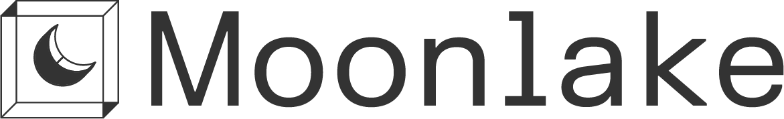

<div align="center">
  

  <h3>Simulation environments for physical AI.</h3>

  <p>
    <a href="https://moonlakeai.mintlify.site/introduction">Documentation</a>
    &nbsp;|&nbsp;
    <a href="https://discord.gg/ZJZB2vymnY">Discord</a>
  </p>
</div>

This is Moonlake's infrastructure for building, loading, and hosting simulation **environments** — the 3D assets, scenes, and their physics. Built for general-purpose robotics & embodied AI learning.

## Works with your engine

Moonlake is not a simulator — it's the content layer. Environments built with Moonlake sit inside the physics engine of your choice:

- **Isaac Lab / Isaac Sim**
- **MuJoCo**
- **Drake**
- any other engine that consumes standard asset formats

---

## Get started

1. Create an [API key](https://app.moonlakeai.com/3d-agent-api) and store it securely.
2. (Optional) Get a quote of the generation with `POST /api/v1/assets`.
3. Start a job by sending the request with `"mode": "generate"`.
4. Track and download results below, or via `GET /api/v1/assets`.

**curl**

```bash
curl -X POST --fail-with-body https://app.moonlakeai.com/api/v1/assets \
  -H "Authorization: Bearer $MOONLAKE_API_KEY" \
  -F 'input={
    "prompt": "a wooden dining chair",
    "references": [{"source": "attached", "name": "reference_0"}]
  };type=application/json' \
  -F 'reference_0=@chair.png' \
  -F 'mode=generate'
```

**python**

```python
import base64
import os
import requests

with open("chair.png", "rb") as reference_file:
    reference = base64.b64encode(reference_file.read()).decode()

response = requests.post(
    "https://app.moonlakeai.com/api/v1/assets",
    headers={"Authorization": f"Bearer {os.environ['MOONLAKE_API_KEY']}"},
    json={
        "input": {
            "prompt": "a wooden dining chair",
            "references": [{"source": "base64", "data": reference}],
        },
        "mode": "generate",
    },
)
```

<p>
  <a href="https://app.moonlakeai.com/3d-agent-api"><strong>Get API key</strong></a>
  &nbsp;·&nbsp;
  <a href="https://moonlakeai.mintlify.site/guides/generate-assets">Generate assets</a>
  &nbsp;·&nbsp;
  <a href="https://moonlakeai.mintlify.site/introduction">API docs</a>
  &nbsp;·&nbsp;
  <a href="https://moonlakeai.mintlify.site/agent-resources">Resources for your agent</a>
</p>

## Contact Us
- For technical questions and feature requests, please use GitHub [Issues](https://github.com/MoonlakeAI/sim-env-builder/issues).
- For discussing with fellow users, please use our [Discord channel](https://discord.gg/ZJZB2vymnY).
- If you wish to use Moonlake's logo, please refer to our [media kit](media_kit/).
- For collaborations and partnerships, please contact us at [contact@moonlakeai.com](mailto:contact@moonlakeai.com).
